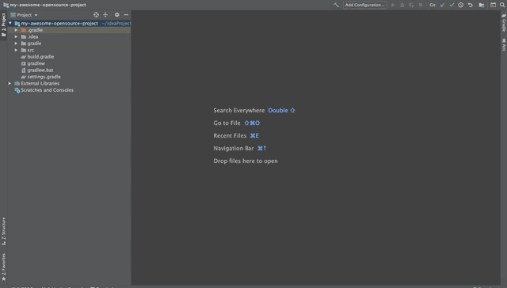

= Licence Generator IntelliJ Plugin

**licence-generator-intellij-plugin** is an IntelliJ Idea plugin that allows you to easily add one of your open source licenses to your project.

== Usage

== Contributions

To run the CheckStyle validations you'll need to run

[source,bash]
----
./gradlew check
----

